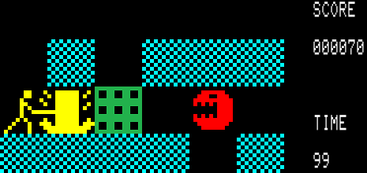
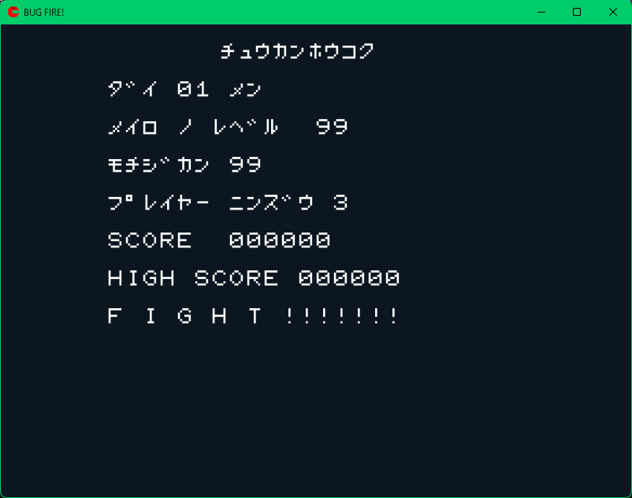
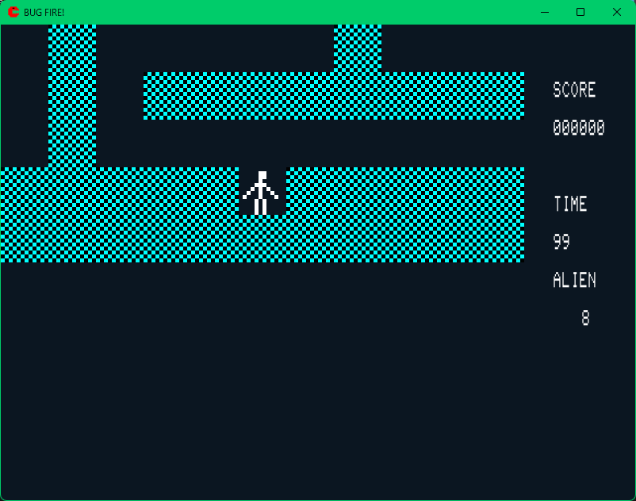
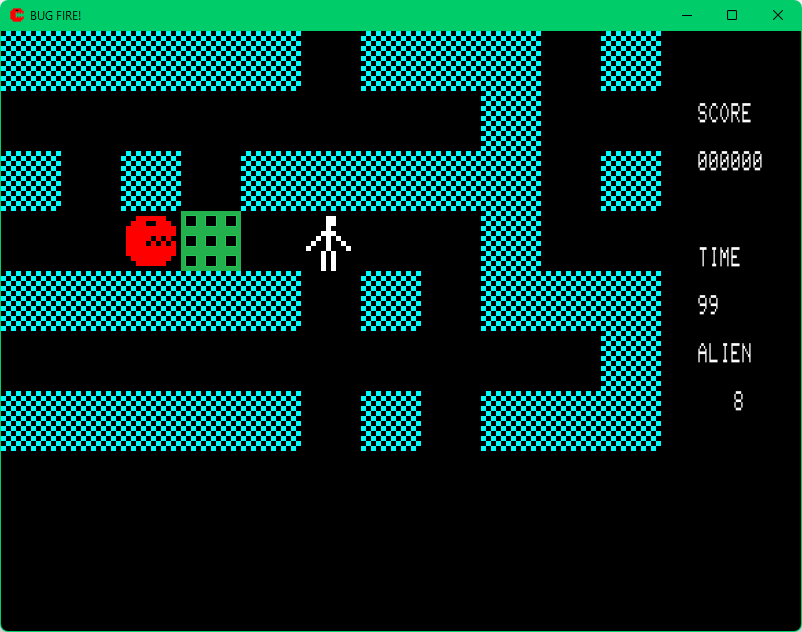
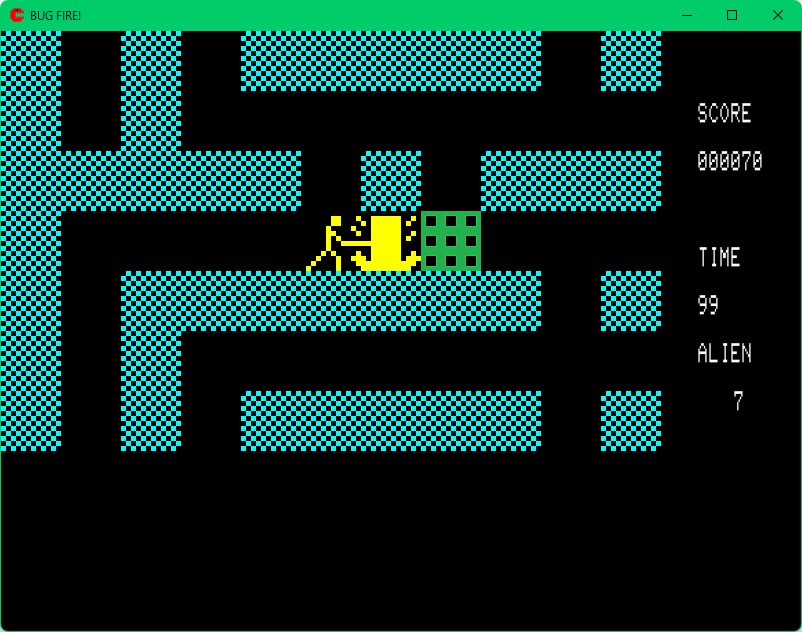
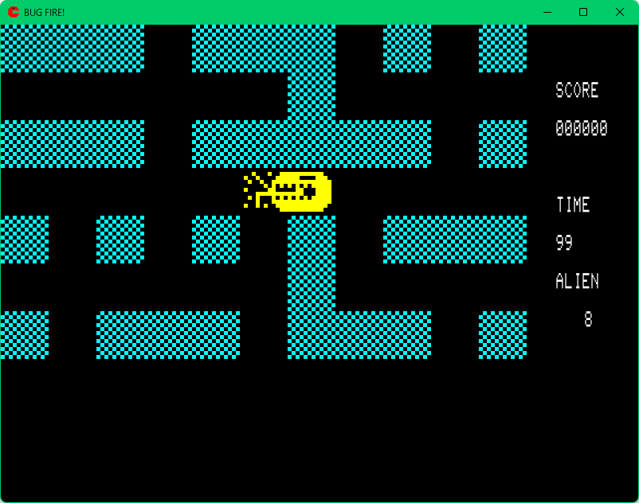
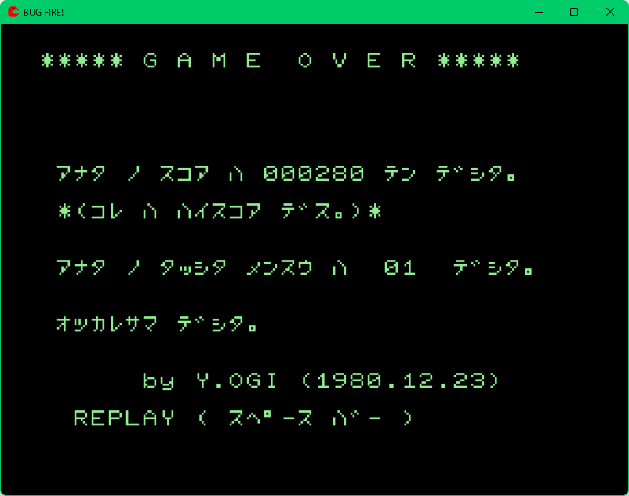

[Japanese](README_JP.md)
# BugFire 
PC-8001 BUG FIRE! on Windows.

It is a game, similar "BUG FIRE!" for PC-8001, almost same.  
You can play the game, with "App/BugFire.exe" only.

## Limitation
- No color flicker of walls or a man. (No plan of implementation, but i feel it cool...).  
(It is PC-8001's CRTC and programming limitation)

- Using 16dot Font, not PC-8001 font. (License limitation)  
Pictures in the document is with PC-8001 font.

- Different position to attack a bug no sleeping.  
Original: bug's neighbour.  
This game: bug.

## Bugs (not a character in game, but programming bugs)
- ~~No "Game Over" with time limit or score < 0.~~  
- ~~A new BUG (after all bugs killed, new one BUG appears) moves not smooth.~~
- BUGs sometimes can not eat the man, when crossing a BUG and a man.
(But it's funny)
- ~~Disappear exit path, after you were killed by a new BUG (after killing all BUGs, a bug will appear).  
  You need to kill the new BUG. **Restart...**~~

and so on...

But you can enjoy it, maybe.

## Difference from Original.
### Key binding.  
* Arrow or "WASD" keys also to control the man, too.  
* ESC key to pause the game.

## Build
This code uses [OpenSiv3D](https://siv3d.github.io/).
Special thanks for OpenSiv3D!.

## License
DO NOT GIVE/COPY/... OTHER PERSON/WEB SITE/... THE SOFTWARE.  
YOU CAN GET THE SOFTWARE FROM THIS SITE OLY.   

Currently I'm checking detail of license.
I'll change the license.

## Screen shots.

Copyright © 2021,2022 shg-eo as SAKUMA, Shigeo. All rights reserved.

